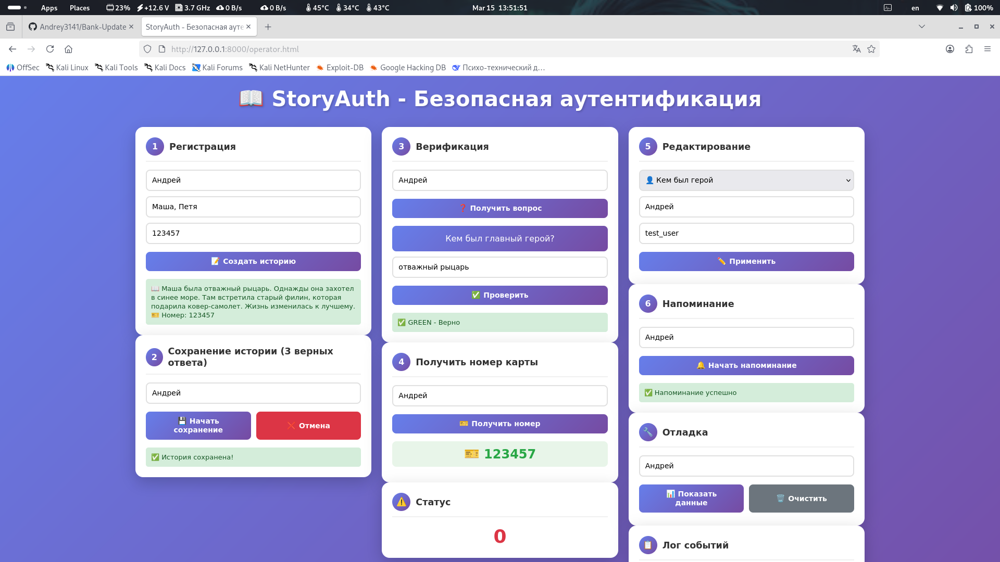

<div align="center">
  
# 📖 StoryAuth v1.1.0


> 🔐 Инновационная система аутентификации на основе персонализированных историй  
> 🧠 3 шага сохранения • Многоуровневая верификация • Защита от брутфорса

</div>

---

## 📋 Оглавление
- [📖 О проекте](#-о-проекте)
- [✨ Возможности](#-возможности)
- [📸 Демонстрация](#-демонстрация)
- [📥 Установка и запуск](#-установка-и-запуск)
- [🎮 Использование](#-использование)
- [🛠 Технологии](#-технологии)
- [🔐 Архитектура безопасности](#-архитектура-безопасности)
- [🔧 Решение проблем](#-решение-проблем)
- [📄 Лицензия](#-лицензия)
- [📬 Контакты](#-контакты-и-поддержка)

---

## 📖 О проекте

**StoryAuth** — это альтернатива традиционным паролям и секретным вопросам. Вместо "девичьей фамилии матери" или "кодового слова" система генерирует уникальную персонализированную историю, которую пользователь запоминает. При каждой верификации задается случайный вопрос из этой истории.

### Почему это безопаснее?

| Традиционные методы | StoryAuth |
|---------------------|-----------|
| Девичью фамилию можно найти в соцсетях | История генерируется случайно и уникальна |
| Кодовое слово можно подсмотреть | Вопросы каждый раз разные |
| Ответы хранятся открыто | Хеширование с уникальной солью |
| Оператор видит ответ | Оператор видит только GREEN/RED |

---

## ✨ Возможности

| Фича | Описание |
|------|----------|
| 🎭 **Генерация историй** | 4 шаблона × 10+ вариантов = тысячи уникальных комбинаций |
| 🔐 **3-шаговое сохранение** | История сохраняется только после 3 правильных ответов |
| 🎫 **Номер карты** | 6-значный код, привязанный к истории |
| 🚫 **Защита от брутфорса** | Блокировка после 3 неверных попыток |
| 🔔 **Напоминания** | Автоматические проверки знаний |
| 📊 **Полное логирование** | Все действия записываются с временными метками |
| 💾 **Автосохранение** | Данные в JSON с автоматической загрузкой |

---

## 📸 Демонстрация

<div align="center">

| 🖥️ Интерфейс оператора |
|:----------------------:|
|  |
| *Удобная панель управления* |

</div>

---

## 📥 Установка и запуск

### ⚡ Быстрый старт

```bash
# 1. Клонируйте репозиторий
git clone https://github.com/Andrey3141/storyauth.git
cd storyauth

# 2. Создайте виртуальное окружение
python -m venv venv
source venv/bin/activate  # Linux/Mac
# или
venv\Scripts\activate     # Windows

# 3. Установите зависимости
pip install -r requirements.txt

# 4. Запустите приложение
python main.py
```

### 📦 Требования
- Python 3.8 или выше
- pip (менеджер пакетов Python)
- Браузер для интерфейса оператора

### 🚀 После запуска

Откройте в браузере: **http://127.0.0.1:8000/operator.html**

---

## 🎮 Использование

### 👤 Для оператора

| Шаг | Действие | Описание |
|-----|----------|----------|
| 1 | **Регистрация** | Введите ID клиента и имена, создайте историю |
| 2 | **Сохранение** | Клиент должен ответить на 3 вопроса подряд |
| 3 | **Верификация** | Задайте случайный вопрос из истории |
| 4 | **Получение номера** | После верификации можно получить номер карты |

### 🔑 Горячие точки интерфейса

- **📝 Регистрация** — создание новой истории
- **💾 Сохранение** — 3 вопроса для активации
- **❓ Вопрос** — получение случайного вопроса
- **🎫 Номер карты** — получение 6-значного кода
- **🔔 Напоминание** — проверка знаний
- **🔧 Отладка** — просмотр данных в JSON

---

## 🛠 Технологии

```
🐍 Python 3.8+      — основной язык
⚡ FastAPI          — веб-фреймворк
🪟 Jinja2           — шаблонизатор
🔐 hashlib          — хеширование с солью
📝 logging          — подробное логирование
💾 JSON             — хранение данных
```

---

## 🔐 Архитектура безопасности

<div align="center">

```
┌─────────────────┐     ┌─────────────────┐     ┌─────────────────┐
│   Регистрация   │────▶│    Сохранение   │────▶│   Верификация   │
│  Генерация      │     │  3 вопроса      │     │  Случайные      │
│  истории        │     │  подряд         │     │  вопросы        │
└─────────────────┘     └─────────────────┘     └─────────────────┘
                                                          │
                                                          ▼
┌─────────────────┐     ┌─────────────────┐     ┌─────────────────┐
│   Блокировка    │◀────│    Напоминание  │◀────│  Получение      │
│  3 неверных     │     │  Проверка       │     │  номера карты   │
│  ответа         │     │  знаний         │     │                 │
└─────────────────┘     └─────────────────┘     └─────────────────┘
```

</div>

### 🔒 Безопасное хранение

```python
# В базе данных НЕ хранится:
"Какого цвета был заяц?" → "Синий"

# Хранится ТОЛЬКО:
hash("Синий" + "уникальная_соль") = "7d3ac23f1e8a..."
```

### 🛡️ Защита от атак

| Атака | Защита |
|-------|--------|
| 🎣 Социальная инженерия | Оператор не видит правильные ответы |
| 💾 Утечка базы данных | Хранятся только хеши с солью |
| 🔄 Перебор ответов | Блокировка после 3 попыток |
| 👀 Подглядывание | Каждый раз разные вопросы |

---

## 🔧 Решение проблем

<details>
<summary>❌ Не запускается сервер</summary>

1. Проверьте, что порт 8000 не занят: `lsof -i :8000`
2. Убедитесь, что все зависимости установлены: `pip install -r requirements.txt`
3. Запустите с явным указанием хоста: `python main.py`
</details>

<details>
<summary>❌ Не открывается интерфейс оператора</summary>

1. Проверьте, что сервер запущен
2. Откройте точный адрес: http://127.0.0.1:8000/operator.html
3. Проверьте папку `templates/` - там должен быть `operator.html`
</details>

<details>
<summary>❌ Не сохраняются данные</summary>

- Проверьте права на запись в папку `data/`
- Убедитесь, что папка `data/` существует (создается автоматически)
- Проверьте JSON файлы в `data/` на корректность
</details>

<details>
<summary>❌ Не приходят вопросы</summary>

1. Убедитесь, что пользователь зарегистрирован
2. Проверьте статус пользователя (не заблокирован ли)
3. Посмотрите в логах ошибки: `tail -f storyauth.log`
</details>

---

## 🤝 Вклад в проект

Приветствуются PR и Issues! 🙌

1. Форкните репозиторий
2. Создайте ветку: `git checkout -b feature/your-feature`
3. Закоммитьте изменения: `git commit -m 'feat: add your feature'`
4. Отправьте: `git push origin feature/your-feature`
5. Откройте Pull Request

---

## 📄 Лицензия

<div align="center">

[](LICENSE)

Проект распространяется под лицензией **MIT**.  
См. файл [LICENSE](LICENSE) для подробностей.

</div>

---

<div align="center">

## 📬 Контакты и поддержка

> 💬 Есть вопрос, идея или нашли баг? Пишите!

[](https://github.com/Andrey3141)
[](https://t.me/tools271)
[](mailto:askackov08@gmail.com)

</div>

---

**StoryAuth** — пароли устарели, используйте истории! 🎭🔐

*Сделано с ❤️ для безопасности*

</div>
